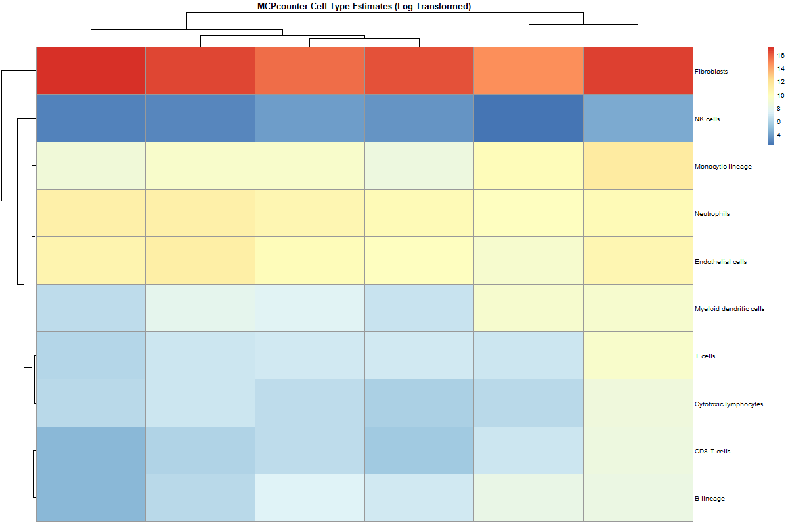
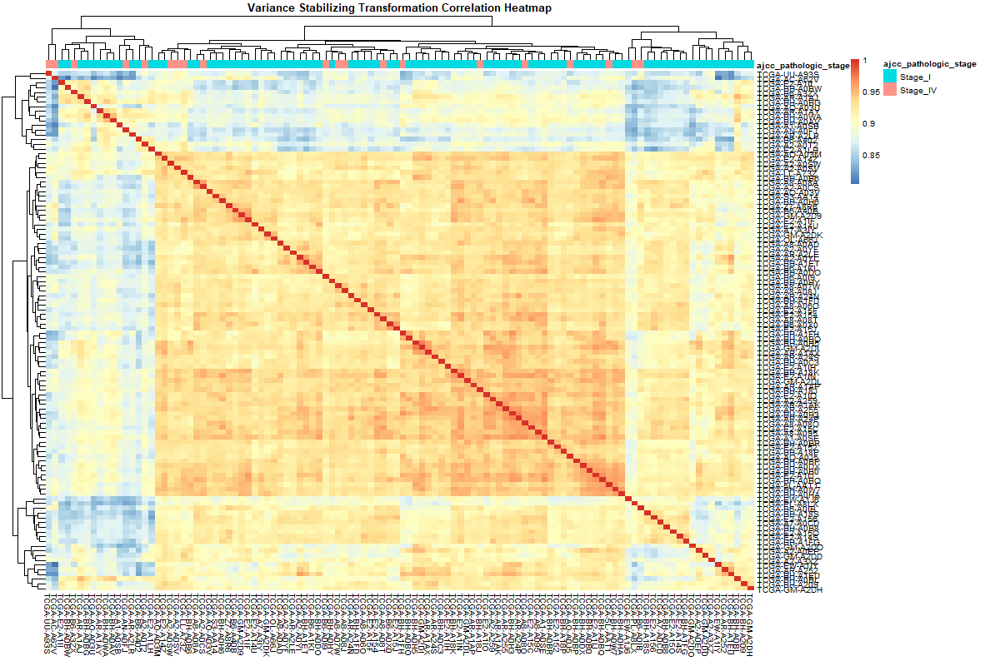
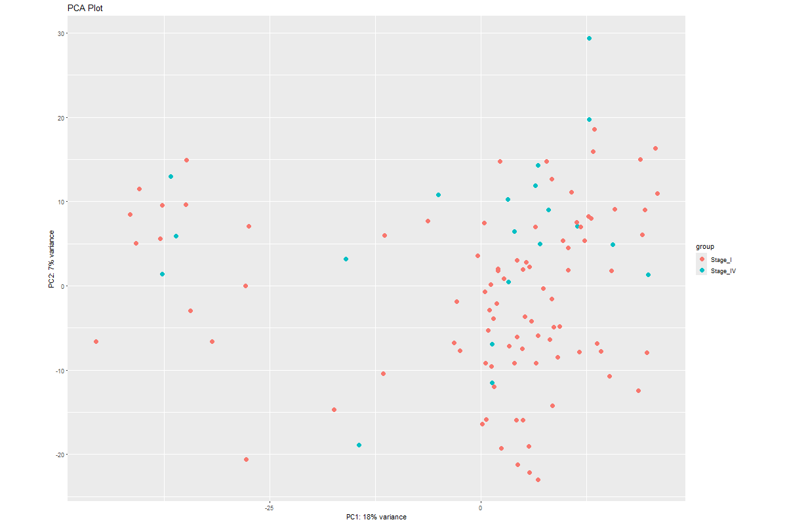
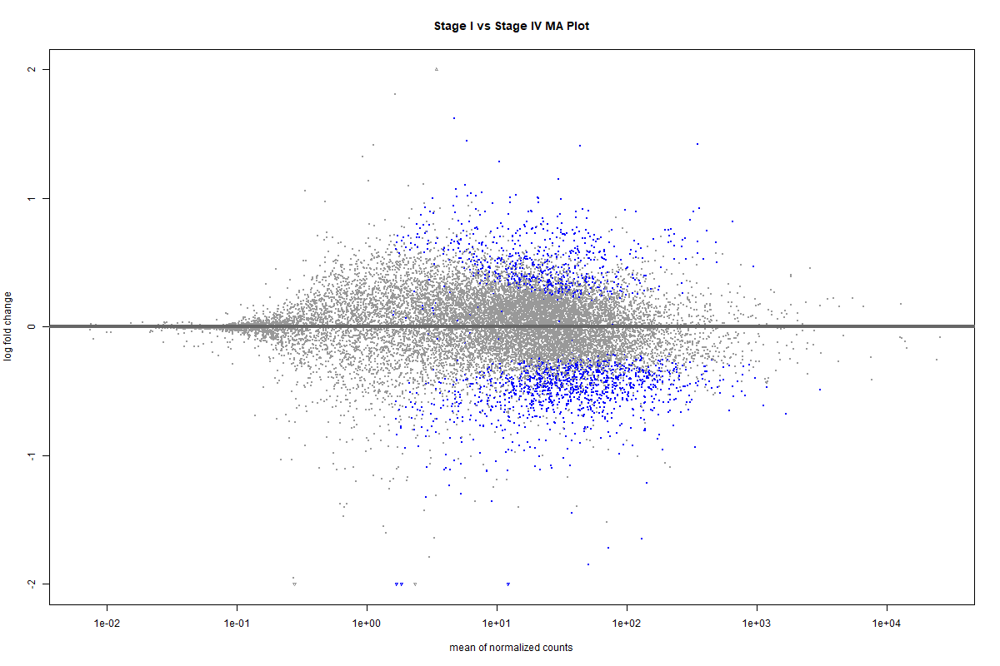
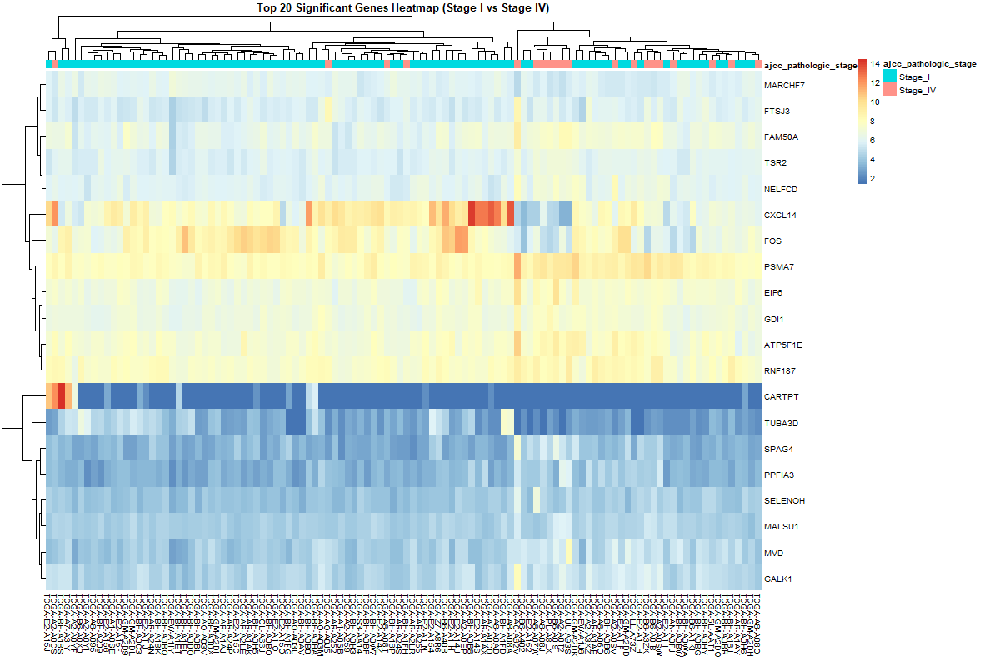
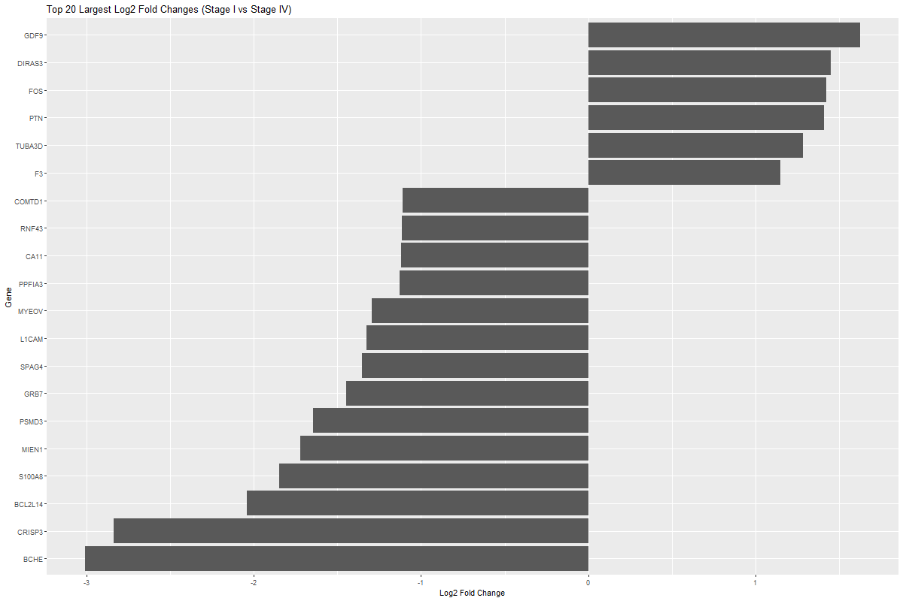

# Breast-Cancer-Infiltrate
Besides skin cancer, breast cancer is the most common cancer in women in the United States. With the rise of new sequencing technology, there is an abundance of public cancer data that can be explored to potentially find new insights towards the treatment for breast cancer. This personal project seeks to explore RNA seq data from The Cancer Genome Atlas (TCGA). Specifically, the RNA seq data from the The Cancer Genome Atlas Breast Invasive Carcinoma Collection (TCGA-BRCA). From this cohort, I'll be exploring 1,111 unique tissue samples sequenced using the Illumina platform. 

With this data, I seek to answer the following questions:
* What major immune cell types infiltrate breast tumors?
* What genes are differentially expressed between Stage I and Stage IV breast cancer? 

The answer to these questions could help guide future therapies by guiding resaerchers towards potential immune and cancer targets as well as provide potential prognostic markers as well.

# Overview
For this project, I utilized ChatGPT to produce a Powershell script that edits the files downloaded from TCGA and prepares them for further cleaning. Next, I used R to perform the rest of the cleaning and analysis. 

In order to answer my first question, I will use MCPcounter, a tool made by Etinne Becht in her paper "Estimating the population abundance of tissue-infiltrating immune and stromal cell populations using gene expression". It returns an "abundance score" using arbitrary units to estimate the populations of various immune and stromal cell types. 

To answer my second question, I will use DEseq2 to perform differential expression analysis. Using a variety of statistical methods, I will be able to determine differentially expressed genes between Stage I and Stage IV Breast Cancer. 

# Results
<h3> Question 1 </h3>

Immune Cell Tumor Infiltrate:
  

> Heatmap of the abundance of cell types in breast cancer tumor per sample. Data suggests fibroblasts are the dominant cell type that infiltrate breast tumors. Monocytes, neutrophils and endothelial cells are also major cell type infiltrate populations. 
 

<h3> Question 2 </h3>

Correlation Matrix:

> Heatmap of the correlation between all samples post Variance Stabilizing Transformation (VST)
 

PCA Plot:

> PCA plot between all samples post Variance Stabilizing Transformation (VST). Low variance of both PC1 and PC2 suggests a multitude of factors are contributing to the variance in the data beyond Tumor Stage.  
 

MA Plot:

> MA plot of DESeq results between Stage I and Stage IV samples with differentially expressed genes in blue. There are significant upregulated and downregulated genes in the Stage IV cancer samples that are also highly expressed. 
 

Volcano Plot Stage I vs Stage IV Cancer:

> Volcano plot of DESeq results between Stage I and Stage IV samples with differentially expresseed genes in red. There are statistically significant (p < 0.05) upregulated and downregulated genes in the Stage IV cancer samples. 
 

Top 20 Most Significant Genes Heat Map:

> Heatmap showing the expression levels of the 20 most statistically significant genes. 
 

Top 20 Highest Absolute Log2Fold Change Amongst Significant Genes:

> Bar plot showing the 20 most upregulated/downregulated significant genes in Stage IV samples (in comparison to Stage I samples).
 

# Conclusions
In regard to my first question, it is unsurprising that fibroblasts are a dominant cell infiltrate in breast tumors as cancer-associated fibroblasts (CAFs) contribute in favor for cancer development due to their immunosuppresive effect on the TME. Monocytes, neutrophils, and endothelial cells also seem to be major cell infiltrate in breast cancer tissue. All of these cell types support cancer growth and development and thus can serve as potential targets in future studies whether to inhibit their promotion of tumor growth or target them for reprogramming such that they combat cancer than support its growth. 

The identification of the most statistically significant genes, along with those showing the largest log2 fold changes, provides a range of potential therapeutic targets and prognostic markers for breast cancer. It was intriguing to find GDF9 more highly expressed in Stage IV than in Stage I, given that lower levels are typically associated with cancer progression and invasiveness. Similarly, BCHE, despite being less studied, was more abundant in Stage I than in Stage IV, highlighting its potential relevance for further investigation. Another noteworthy finding was CXCL14 expression in the heatmap. Its high levels in Stage I and reduced expression in Stage IV align with previous research demonstrating its anti-tumoral properties, reinforcing its role in cancer suppression.

Overall, I'm excited to have analyzed and collected these results as I hope these cell types and genes I have outlined will support the need for their further research in their roles in breast cancer.

# Limitations
As this was my first attempt at RNA-seq analysis, I have many limitations that contribute to my results that I will list below:
* Unfortunately, TCGA does not have open access for the RNA-seq raw counts and thus I have no clue how they were read. This affected my analysis as I used unstranded counts to proceed as I did not know the read data strandedness. 
* In terms of analyzing cell infiltrate, it would have been much more interesting if I was able to use other more popular and specific immune infiltration tools such as CIBERSORT or TIMER. 
* I did not take into account a variety of confounding variables that would affect my analyses. This includes things such as age, ethnicty, ongoing therapies, etc.
* Despite the large dataset, by narrowing my focus to only Stage I and Stage IV samples, it potentially reduced the statistical power of my analsis.

Hopefully in future analyses, I will overcome these limitations and produce even better work as I continue to grow as an aspiring bioinformatician. 

If you got this far, thank you so much for reading! 🙏
