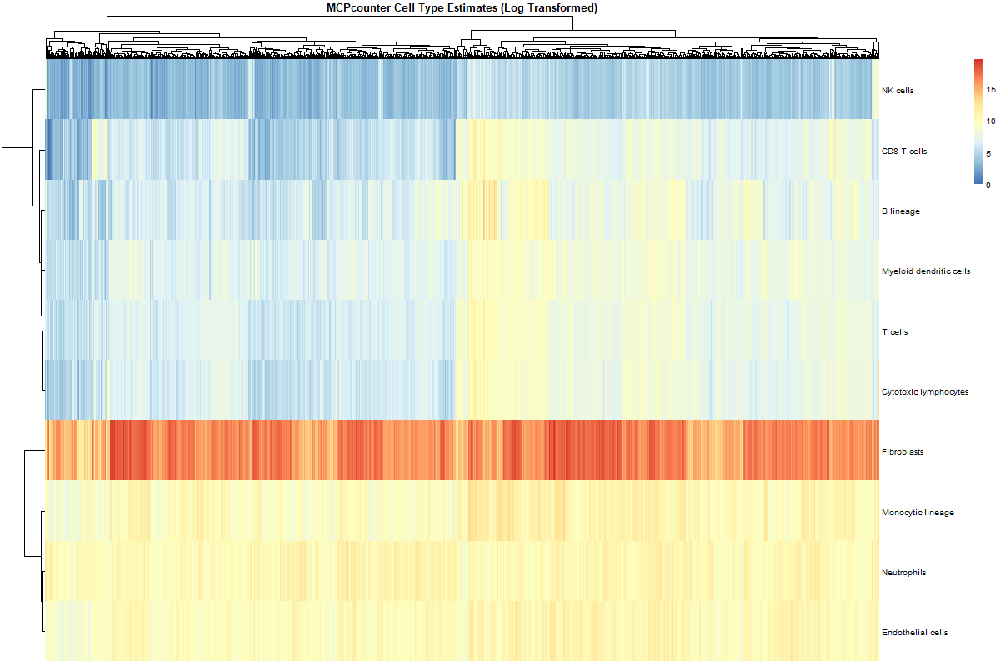
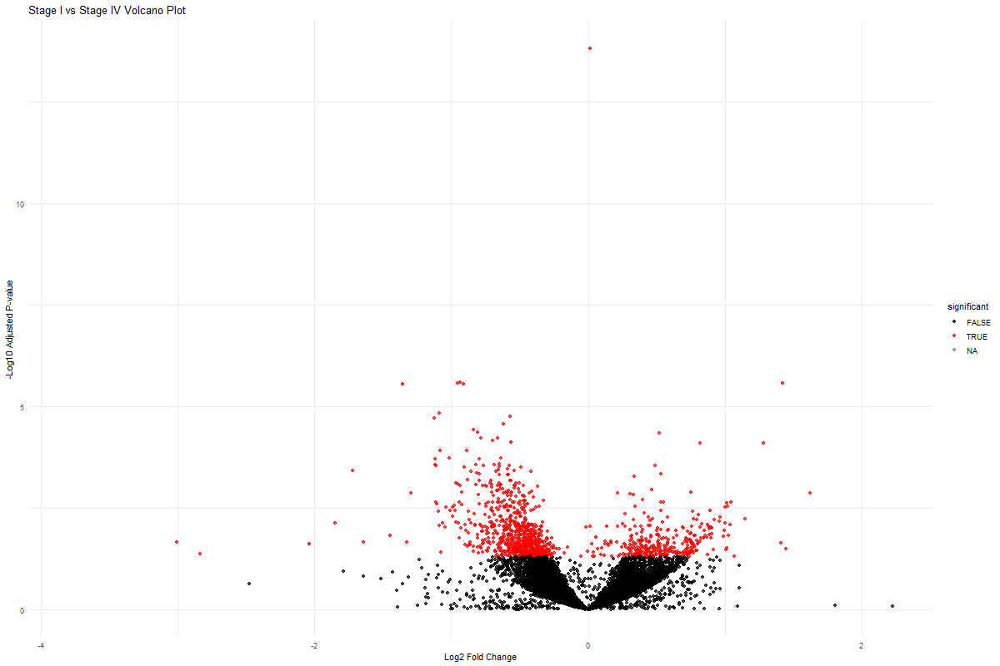

# Breast-Cancer-Infiltrate
Besides skin cancer, breast cancer is the most common cancer in women in the United States. With the rise of new sequencing technology, there is an abundance of public cancer data that can be explored to potentially find new insights towards the treatment for breast cancer. This personal project seeks to explore RNA seq data from The Cancer Genome Atlas (TCGA). Specifically, the RNA seq data from the The Cancer Genome Atlas Breast Invasive Carcinoma Collection (TCGA-BRCA). From this cohort, I'll be exploring 1,111 unique tissue samples sequenced using the Illumina platform. 

With this data, I seek to answer the following questions:
* What major immune cell types infiltrate breast tumors?
* What genes are differentially expressed between Stage I and Stage IV breast cancer? 

The answer to these questions could help guide future therapies by guiding resaerchers towards potential immune and cancer targets as well as provide potential prognostic markers as well.

# Overview
For this project, I utilized ChatGPT to produce a Powershell script that edits the files downloaded from TCGA and prepares them for further cleaning. Next, I used R to perform the rest of the cleaning and analysis. 

In order to answer my first question, I will use MCPcounter, a tool made by Etinne Becht in her paper "Estimating the population abundance of tissue-infiltrating immune and stromal cell populations using gene expression". It returns an "abundance score" using arbitrary units to estimate the populations of various immune and stromal cell types. 

To answer my second question, I will use DEseq2 to perform differential expression analysis. Using a variety of statistical methods, I will be able to determine differentially expressed genes between Stage I and Stage IV Breast Cancer. 

# Results

Immune Cell Tumor Infiltrate:
  

  

Correlation Matrix:

  

PCA Plot:

  

MA Plot:

  

Volcano Plot Stage I vs Stage IV Cancer:

  

Top 20 Most Significant Genes Heat Map:

  

Top 20 Highest Absolute Log2Fold Change Amongst Significant Genes:

  
